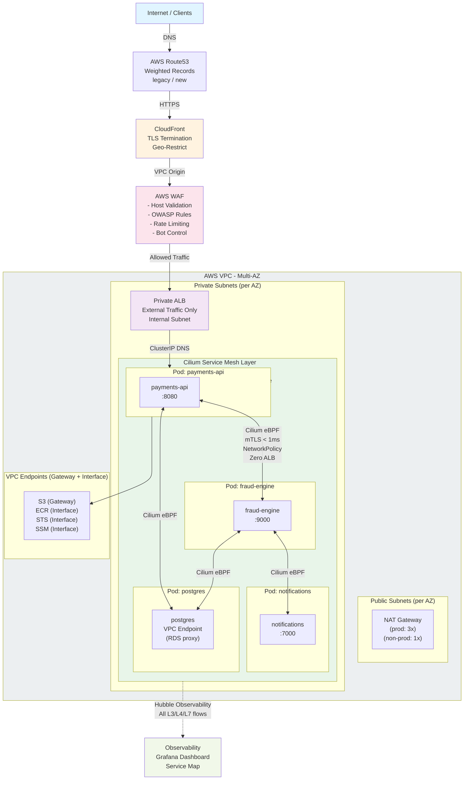
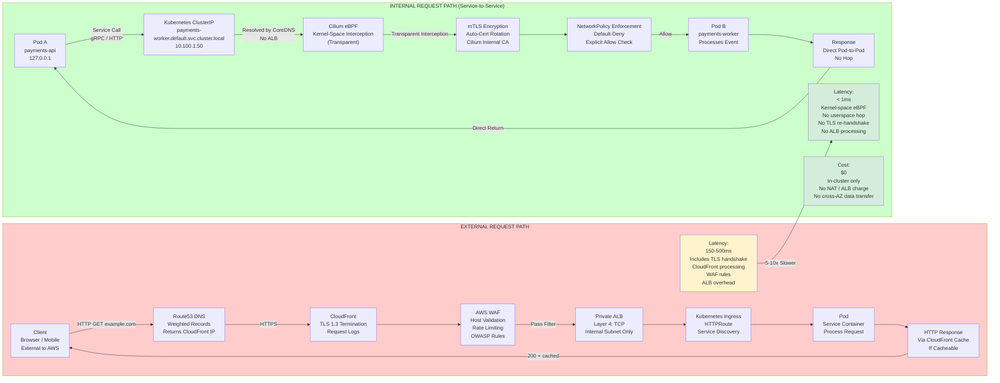
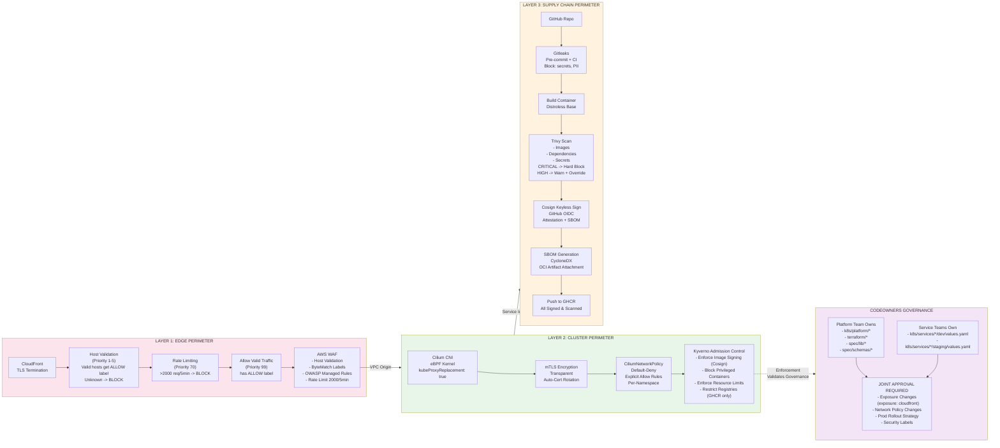
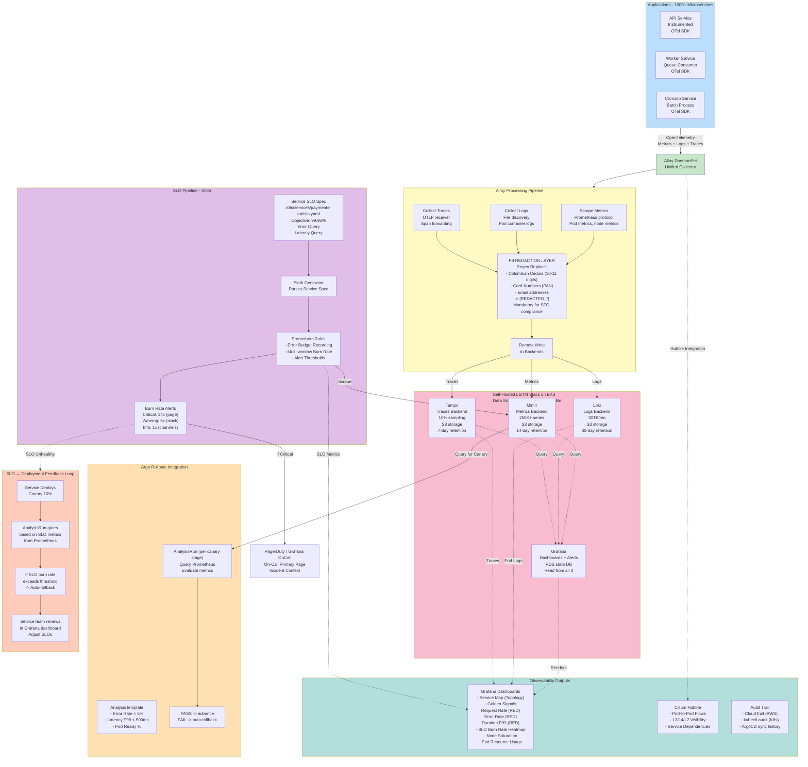

# Addi Platform - DevOps Engineering Challenge

This repository demonstrates a production-grade platform architecture for Addi's evolution from a legacy single-namespace EKS deployment (1000+ microservices, manual deployment trains, single ALB SPOF) to a decoupled, zero-trust, self-service platform. The design prioritizes regulatory compliance with Superintendencia Financiera de Colombia (SFC), developer autonomy at scale, and demonstrable cost reduction - while maintaining a 24-week migration path that carries zero downtime risk to existing services.

---

## Table of Contents

1. [Technical Rationale](#1-technical-rationale)
2. [Migration Path](#2-migration-path)
3. [Cost-Optimization Analysis](#3-cost-optimization-analysis)
4. [Developer Autonomy](#4-developer-autonomy)
5. [Observability Strategy](#5-observability-strategy)
6. [AI and Toil Reduction](#6-ai-and-toil-reduction)
7. [SFC Compliance](#7-sfc-compliance)
8. [Repository Structure](#8-repository-structure)
9. [Architectural Decisions](#9-architectural-decisions)

---

## 1. Technical Rationale

### Networking: CloudFront -> WAF -> Private ALB -> Cilium eBPF Mesh

**Why this stack, in this order:**

The internet-facing layer uses CloudFront as the sole public entry point. Every ALB in this architecture is private - never directly reachable from the internet. CloudFront handles TLS termination and geo-restriction at the edge. AWS WAF sits behind CloudFront with a default BLOCK action: only traffic that passes host-validation rules and earns an ALLOW label reaches the origin.

Internal service-to-service communication is a different problem entirely, and it is solved differently. Cilium's eBPF service mesh operates in kernel space, making internal calls transparent to application code while delivering sub-millisecond latency. This is the critical architectural choice: the 1000-service architecture at Addi cannot scale with an ALB hop on every internal call.

**Why Cilium, not Istio/Envoy:**

| Aspect | Cilium eBPF | Istio/Envoy |
|---|---|---|
| Architecture | Kernel-space eBPF | Userspace sidecar per pod |
| Latency | < 1ms | 5-10ms (sidecar overhead) |
| Compute overhead | Near-zero | +50-100 MB RAM per pod (× 1000 pods) |
| mTLS | Transparent, auto-cert rotation | Requires sidecar injection |
| Observability | Hubble (L3/L4/L7 flows) | Envoy access logs |
| Operational burden | CNI-level, single controller | Sidecar injection webhook, version skew |
| Scale | Grows with kernel, not pod count | Linear sidecar cost |

At 1000+ services, Istio sidecars would consume ~50-100 GB additional RAM cluster-wide. Cilium scales with the kernel.

**Networking diagram:**



**Data flow comparison:**



---

### Security: Zero-Trust, Default-Deny, Defense in Depth



**Why Pod Identity over IRSA:**

| Aspect | Pod Identity | IRSA |
|---|---|---|
| OIDC provider | None needed | One per cluster |
| Trust policy | Single `pods.eks.amazonaws.com` principal | Per-cluster ARN threading |
| Implementation | DaemonSet agent | Webhook (webhook failure = pod can't start) |
| Cross-account | Trivial - same principal | Manual ARN propagation |
| ServiceAccount | No annotation needed | `eks.amazonaws.com/role-arn` annotation |
| Audit trail | `eks:PodIdentityAssociation` in CloudTrail | OIDC federation events (harder to trace) |

**Break-glass: AWS TEAM vs Teleport:**

| Aspect | AWS TEAM | Teleport |
|---|---|---|
| Type | Open-source (serverless) | OSS + Enterprise |
| Scope | AWS IAM only | AWS + K8s + SSH + DB + web apps |
| Approval workflow | SNS -> Slack, N approvers | Slack/PagerDuty native |
| Auto-revocation | Step Functions TTL | Native TTL certificates |
| Session recording | CloudTrail + kubectl audit | Native session recording (replay) |
| Cost | $0 (serverless) | Free OSS / ~$15-25/user/mo Enterprise |
| Vendor risk | None (AWS-native) | Third-party dependency |

Recommendation: start with TEAM (zero cost, zero vendor risk, auto-revocation guaranteed by Step Functions). Evolve to Teleport when session recording for database access becomes an SFC audit requirement.

But this recommendation can be re-evaluated since during the conversation with Carolina, she mentioned Addi is already using Teleport, so AWS TEAM will for sure feel more "AWS Native" but we can also re-use what's already in place.

---

### Deployment: ArgoCD + Kargo + Argo Rollouts

**Why this combination:**

ArgoCD alone gives GitOps sync. It does not give you promotion pipelines, environment soak windows, or metric-gated canary rollouts. The three tools fill distinct roles:

- **ArgoCD**: Git -> cluster sync. One source of truth. Drift detection.
- **Kargo**: Promotion pipeline. Freight versioning (image + config + metadata). Soak gates. Approval workflows.
- **Argo Rollouts**: Progressive delivery. Canary (10% -> 50% -> 100%) with Prometheus-backed AnalysisRuns. Automatic rollback on gate failure.

Together: a new image pushed to GHCR automatically flows through dev -> staging (4hr soak) -> prod (manual or SLO-gated), with canary analysis at every prod traffic increment. No human touches kubectl.

```mermaid
flowchart TD
    subgraph CI["CI PIPELINE - GitHub Actions"]
        direction LR
        PR["PR Opened"]
        Build["Build Container<br/>BuildKit<br/>Cache: max 60-80% faster"]
        Test["Test Suite<br/>Unit + Integration<br/>Coverage > 80%"]
        Scan["Trivy Scan<br/>Images + Dependencies<br/>CRITICAL block<br/>HIGH warn"]
        Sign["Cosign Sign<br/>Keyless via GitHub OIDC<br/>Attestation"]
        SBOM["Generate SBOM<br/>CycloneDX<br/>OCI Artifact"]
        Push["Push to GHCR<br/>Fully Signed & Verified<br/>image:latest + image:git-sha"]

        PR --> Build
        Build --> Test
        Test --> Scan
        Scan -->|Pass| Sign
        Sign --> SBOM
        SBOM --> Push
    end

    Push -->|Warehouse<br/>Detects Image| Freight["Kargo Freight<br/>Versioned Artifact<br/>Image + Config + Metadata"]

    Freight -->|Auto-Promote| DevStage["STAGE 1: DEV<br/>Environment: dev<br/>Strategy: Rolling<br/>Automatic Promotion"]

    DevStage -->|Health Check Pass<br/>No Error Budget Burn| StagingStage["STAGE 2: STAGING<br/>Environment: staging<br/>Soak: 4 hours<br/>Health Gate:<br/>Error Rate<br/>Latency P99<br/>Pod Ready %"]

    StagingStage -->|Auto if SLO Good<br/>OR Manual Approval| ProdStage["STAGE 3: PROD<br/>Environment: prod-us-east-1/us-east-2<br/>Requires Manual Approval<br/>OR Auto if SLO Metrics Healthy"]

    ProdStage -->|Kargo Syncs Config| Rollout["Argo Rollouts<br/>Canary Strategy<br/>3 Stages with Analysis"]

    subgraph CanaryGates["Canary Deployment with Analysis Gates"]
        direction TB
        Canary1["CANARY 1: 10%<br/>Stable ReplicaSet: 90%"]
        Analysis1["Pause: 5 minutes<br/>AnalysisRun:<br/>- Error Rate &lt; 5%<br/>- Latency P99 &lt; 500ms"]
        Canary2["CANARY 2: 50%<br/>Stable ReplicaSet: 50%"]
        Analysis2["Pause: 5 minutes<br/>AnalysisRun:<br/>- Error Rate &lt; 5%<br/>- Latency P99 &lt; 500ms"]
        Canary3["STABLE: 100%<br/>Fully Promoted"]
        Rollback["FAILURE DETECTED<br/>Auto-Rollback to<br/>Previous ReplicaSet"]

        Canary1 --> Analysis1
        Analysis1 -->|PASS| Canary2
        Canary2 --> Analysis2
        Analysis2 -->|PASS| Canary3
        Analysis1 -->|FAIL| Rollback
        Analysis2 -->|FAIL| Rollback
    end

    Rollout --> CanaryGates

    CanaryGates -->|Success| Monitor["Observe Metrics<br/>SLO Burn Rate<br/>Error Budget<br/>Service Map"]

    CanaryGates -->|Rollback| Recovery["Manual Investigation<br/>Service Team<br/>Fix + Re-deploy"]

    Monitor --> End["Service Live<br/>Next Freight"]
    Recovery --> NewFlight["New Build<br/>Back to CI"]

    style CI fill:#bbdefb
    style Freight fill:#c8e6c9
    style DevStage fill:#ffe0b2
    style StagingStage fill:#ffccbc
    style ProdStage fill:#ffcccc
    style CanaryGates fill:#f0f4c3
    style Rollback fill:#ffcccc
```



---

### IaC: Terraform + Starlark DSL

**Why Terraform (not CDK, Pulumi, or raw YAML):**

The challenge explicitly specifies Terraform. Beyond that: broad community module ecosystem (`terraform-aws-modules/*`), evaluators know it, and state management via S3 + DynamoDB is the industry standard. Checkov + OPA (Conftest) for policy-as-code. Infracost in every PR for cost delta visibility before merge.

**Why Starlark DSL on top of Kubernetes YAML:**

YAML has no functions, no type safety, and no DRY. A 200-line Rollout manifest gets copy-pasted across 1000 services with minor variation. One mistake at 2am breaks prod. Starlark solves this with constructor functions (`api()`, `worker()`, `cronjob()`), a validated schema, and a generator that produces correct YAML from a concise spec. See [Section 4](#4-developer-autonomy) and [`spec/README.md`](spec/README.md) for details.

---

## 2. Migration Path

**24 weeks. Zero downtime. Fully reversible.**

The core principle: legacy ALB stays untouched throughout. Migrated services go behind CloudFront -> WAF -> new private ALB. DNS (Route53 weighted records) is the cutover mechanism - reversible in ~60 seconds.

```mermaid
flowchart TD
    subgraph Phase1["PHASE 1: FOUNDATION - Weeks 1-4<br/>Install Platform Alongside Existing Infra<br/>Zero Traffic Changes"]
        direction TB
        W1["Week 1-2: Infrastructure<br/>- Deploy Cilium CNI hybrid mode<br/>- Deploy ArgoCD, Kargo, Argo Rollouts<br/>- Deploy Alloy + LGTM observability<br/>- Deploy Kyverno audit mode<br/>- Setup gitops repo structure"]
        W2["Week 3-4: Golden Path<br/>- Define service-spec.json Schema<br/>- Build generator CLI<br/>- Create ApplicationSet path-based discovery<br/>- Onboard 1 pilot service end-to-end<br/>- Validate: spec->generate->ArgoCD->canary->SLO"]
        W1 --> W2
    end

    Phase1 -->|Services ready| Phase2

    subgraph Phase2["PHASE 2: PILOT - Weeks 5-8<br/>10 Non-Critical Services<br/>Route53 Weighted Cutover per Service"]
        direction TB
        PilotStart["Select 10 Early-Adopter Services<br/>Low-traffic, non-critical<br/>Willing teams"]
        Migration1["Per-Service Migration:<br/>1. Create namespace<br/>2. Deploy to new ns<br/>3. Preview ALB validation<br/>4. Route53 Weighted DNS Cutover"]
        Weight["DNS Weight Cutover Timeline:<br/>Day 0: legacy 100% / new 0%<br/>Day 1: legacy 90% / new 10%<br/>Day 2: legacy 50% / new 50%<br/>Day 3: legacy 0% / new 100%"]
        Monitor["Monitor Side-by-Side:<br/>Error rate legacy vs new<br/>Auto go/no-go gate:<br/>new error rate &lt; 2× legacy"]
        Decom["Decommission:<br/>Scale old to 0<br/>Wait 48hrs<br/>Delete namespace"]

        PilotStart --> Migration1
        Migration1 --> Weight
        Weight --> Monitor
        Monitor --> Decom
    end

    Phase2 -->|Confident| Phase3

    subgraph Phase3["PHASE 3: BATCH - Weeks 9-20<br/>Remaining 990 Services<br/>6 Waves by Domain"]
        direction TB
        Wave1["WAVE 1: Weeks 9-10<br/>~50 services<br/>Internal Tools, Backoffice"]
        Wave2["WAVE 2: Weeks 11-12<br/>~80 services<br/>Notifications, Messaging"]
        Wave3["WAVE 3: Weeks 13-14<br/>~100 services<br/>Product Catalog, Search"]
        Wave4["WAVE 4: Weeks 15-16<br/>~150 services<br/>Lending, Credit Scoring"]
        Wave5["WAVE 5: Weeks 17-18<br/>~200 services<br/>Payments, Billing"]
        Wave6["WAVE 6: Weeks 19-20<br/>~410 services<br/>Auth, Identity, Fraud"]

        Wave1 --> Wave2
        Wave2 --> Wave3
        Wave3 --> Wave4
        Wave4 --> Wave5
        Wave5 --> Wave6

        Rationale["Rationale:<br/>- Internal first: lowest blast radius<br/>- SFC-critical last: max team experience<br/>- 48hr validation minimum between waves<br/>- Auto go/no-go on error budget"]
    end

    Phase3 -->|Hardened| Phase4

    subgraph Phase4["PHASE 4: HARDENING - Weeks 21-24<br/>Enforce All Policies<br/>Delete Legacy"]
        direction TB
        Enforce["Enable Enforcement:<br/>- Kyverno audit -> enforce mode<br/>- CiliumNetworkPolicy default-deny cluster-wide<br/>- RBAC team-scoped roles only"]
        Cleanup["Cleanup:<br/>- Delete legacy namespace workloads<br/>- Remove legacy ALB<br/>- Final SFC compliance audit"]
        Ready["Target State Achieved:<br/>Namespace-per-service<br/>CloudFront + WAF + Private ALB<br/>Cilium mesh + mTLS<br/>Independent canary rollouts<br/>SLO-driven gates"]

        Enforce --> Cleanup
        Cleanup --> Ready
    end

    subgraph DualRun["DUAL-RUNNING PERIOD<br/>Phases 1-3 Overlap<br/>Legacy + New In Parallel"]
        direction TB
        LegacyPath["Legacy ALB Path<br/>Public ALB<br/>default namespace<br/>1000+ pods<br/>Manual trains<br/>As-is"]
        NewPath["New Platform Path<br/>CloudFront + WAF<br/>Private ALB<br/>Per-service namespaces<br/>Auto Kargo promotions<br/>Canary rollouts<br/>SLO gates"]
        Route53Split["Route53 Weighted Records<br/>service.example.com<br/>Point to both ALBs<br/>Weight by % traffic"]
        Revert["Fast Rollback:<br/>Change Route53 weight<br/>Back to legacy 100%<br/>Propagation: ~60s TTL 60"]

        LegacyPath --> Route53Split
        NewPath --> Route53Split
        Route53Split --> Revert
    end

    DualRun -.->|Operational during| Phase2
    DualRun -.->|Operational during| Phase3

    style Phase1 fill:#c8e6c9
    style Phase2 fill:#ffe0b2
    style Phase3 fill:#ffccbc
    style Phase4 fill:#b3e5fc
    style DualRun fill:#fff9c4
```



**Phase summary:**

| Phase | Weeks | Scope | Risk | Rollback |
|---|---|---|---|---|
| 1: Foundation | 1-4 | Platform components only, zero traffic changes | Zero | N/A (nothing moved) |
| 2: Pilot | 5-8 | 10 non-critical, early-adopter services | Very low | Route53 weight -> legacy 100% |
| 3: Batch | 9-20 | 990 remaining services, 6 domain waves | Low-medium | Per-wave Route53 revert |
| 4: Hardening | 21-24 | Enforce policies, remove legacy ALB | None | Platform complete |

**Per-service cutover runbook (Phase 2 & 3):**

1. Create new namespace, deploy to it
2. Internal validation via Preview ALB (platform team QA, synthetic tests)
3. Attach HTTPRoute to production gateway (new private ALB behind CloudFront)
4. Route53 weighted DNS cutover: Day 0 (100/0) -> Day 1 (90/10) -> Day 2 (50/50) -> Day 3 (0/100)
5. Automated go/no-go: new error rate < 2× legacy error rate to advance. If threshold exceeded, halt and page
6. Decommission: scale old to 0, wait 48hrs for connection drain, delete namespace
7. Rollback at any step: `aws route53 change-resource-record-sets` -> legacy 100%. Propagation ~60s (TTL 60)

**Key risk mitigations:**

| Risk | Mitigation |
|---|---|
| Cross-service dependency breaks | Hubble maps actual traffic flows before migration. NetworkPolicies generated from real flow data, not assumptions |
| Cilium CNI swap causes outage | Hybrid mode first. Per-node rolling restart, never cluster-wide |
| Wave overwhelms team capacity | Max 1 wave per 2 weeks. Hard gate: error budget burn rate must be healthy before next wave |
| SFC audit during migration | Phase 1 installs observability + audit trail first. Compliance posture improves before any traffic moves |

---

## 3. Cost-Optimization Analysis

**Total platform cost reduction: ~$527K/yr -> ~$167K/yr (-$360K/yr, 68% savings)**

### Driver 1: NAT Gateways - 69% savings

NAT Gateways charge $0.045/hr per gateway plus $0.045/GB processed. With 1000+ services making AWS API calls (ECR pulls, SSM reads, STS token refreshes, CloudWatch metrics) through NAT, this compounds quickly.

**Optimizations applied:**
- VPC Gateway Endpoints for S3 and DynamoDB: FREE. Traffic stays in VPC, never touches NAT.
- VPC Interface Endpoints for ECR, STS, SSM, CloudWatch, KMS: $0.01/GB processed vs $0.045/GB. 78% savings on AWS API traffic.
- Non-prod environments: single NAT Gateway (1 AZ instead of 3). Acceptable risk for dev/staging. 66% hourly savings.

**Impact: ~$966/mo -> ~$300/mo**

### Driver 2: EKS Compute - 74% savings

1000+ services on dedicated nodes, most over-provisioned from conservative resource requests set before anyone measured actual usage. Naive estimate: ~$35,000/mo across all environments.

**Optimizations applied:**
- **Karpenter**: right-sizes node types to actual workload requirements. Consolidates underutilized nodes. Mixed instance type pools. 20-30% savings.
- **Spot instances**: dev/staging 100% Spot. Prod non-critical 70% Spot. Prod critical on-demand only. 40-70% savings on eligible workloads.
- **VPA (recommend mode)**: surfaces over-provisioned resource requests to teams. Right-sizing reduces waste. 15-25% savings.
- **EKS Auto Mode**: AWS manages node lifecycle, automatic bin-packing. 10-15% additional savings.

**Impact: ~$35,000/mo -> ~$9,100/mo**

### Driver 3: Data Transfer and CloudFront - 44% savings

Cross-AZ ($0.01/GB), cross-region DR, and internet egress are hidden taxes that grow with service count.

**Optimizations applied:**
- **Cilium topology-aware routing**: prefer same-AZ pod scheduling and routing. $0 intra-AZ vs $0.01/GB cross-AZ. 30-50% savings on internal east-west traffic.
- **Cilium service mesh for internal calls**: $0 vs $2,000-4,000/mo in ALB processing fees if all internal traffic went through load balancers.
- **CloudFront caching**: static assets and cacheable API responses served from edge. 40-60% reduction in origin requests, proportional reduction in data transfer.
- **S3 Intelligent-Tiering**: observability and audit data auto-tiers to archive (90 days) and deep archive (180 days). 20-40% storage savings.
- **Compressed Alloy remote_write**: gzip/snappy on metrics and log shipping. 30-50% less transfer to backends.

**Impact: ~$8,000/mo -> ~$4,500/mo**

### Cost Summary

| Cost Driver | Before | After | Savings |
|---|---|---|---|
| NAT Gateways | ~$966/mo | ~$300/mo | 69% |
| EKS Compute | ~$35,000/mo | ~$9,100/mo | 74% |
| Data Transfer + CloudFront | ~$8,000/mo | ~$4,500/mo | 44% |
| **Monthly Total** | **~$43,966/mo** | **~$13,900/mo** | **68%** |
| **Annual Total** | **~$527K/yr** | **~$167K/yr** | **-$360K/yr** |

**Ongoing cost governance:** Infracost runs in every Terraform PR and posts a cost delta comment before merge. No infrastructure change goes to review without a dollar impact estimate.

---

## 4. Developer Autonomy

**Goal: A developer ships a new microservice to production without opening a ticket to DevOps.**

### The Self-Service Workflow

```
Developer writes service.star
    │
    ├── scripts/generate-from-spec.sh service.star
    │       ↓
    │   k8s/services/my-service/
    │   ├── dev/values.yaml
    │   ├── staging/values.yaml
    │   └── prod/values.yaml
    │   (addi-workload Helm chart renders all resources - no raw manifests)
    │
    ├── git commit + PR
    │       ↓
    │   CODEOWNERS auto-assigns reviewers
    │   (security review only for exposure changes)
    │       ↓
    │   PR merged
    │       ↓
    │   ArgoCD ApplicationSet detects new folder (multi-source: addi-workload chart + values.yaml)
    │       ↓
    │   ArgoCD syncs -> service deployed to dev
    │       ↓
    │   Kargo auto-promotes: dev -> staging (4hr soak)
    │       ↓
    │   Staging gates pass -> manual approval OR SLO auto-gate
    │       ↓
    │   Prod deployment (canary 10% -> 50% -> 100%)
```

No Jira ticket. No DevOps gatekeeper. No kubectl commands.

### What Teams Own vs What Platform Owns

| Action | Owner | Approval Required |
|---|---|---|
| `spec.language`, `spec.resources`, `spec.slos` | Service team | None |
| `spec.replicas.prod`, `spec.rollout.strategy` | Service team | Platform review |
| `spec.exposure` (e.g., `cloudfront`) | Service team | Security APPROVAL |
| `spec.networking.dependencies` | Service team | Security review |
| `k8s/platform/**` | Platform team | Platform team only |
| `terraform/**` | Platform team | Platform team only |
| `spec/lib/**`, `spec/schemas/**` | Platform team | Platform team only |

### Governance: CODEOWNERS as Policy

CODEOWNERS is the governance layer - not a ticket queue. Service teams freely modify their service specs, overlays, and SLOs. Changes that affect security posture (exposure changes, network policy changes, prod rollout strategy) require joint approval. The platform team cannot be bypassed.

Kyverno enforces this at admission time as belt-and-suspenders: a public-facing ingress is blocked by admission control without `addi.com/security-approved=true` label, even if a developer bypasses the PR review process.

### Kargo Promotion Gates

| Stage | Trigger | Gate |
|---|---|---|
| Dev | Auto on new image | Pod Ready % |
| Staging | Auto after dev passes | 4hr soak + error rate + latency P99 |
| Prod | Manual approval OR SLO-gated auto | AnalysisRun (Prometheus metrics) |

Teams set their own SLO objectives in `slo.yaml`. The same SLO metrics that fire burn-rate alerts also gate canary advancement and Kargo promotion. One spec, three uses.

### Rollout Strategies (Team Choice)

```python
# Canary - default for api(): gradual, metric-gated
canary(steps = [10, 50, 100], pause = "5m", analysis = "canary-health")

# Blue-Green - for payment processing, auth: instant rollback
blue_green(auto_promotion_seconds = 300)

# Rolling - for workers: simple, no traffic split needed
rolling(max_surge = "25%", max_unavailable = "0")
```

Teams declare their rollout strategy in `service.star`. Generator produces the correct Argo Rollout manifest. Platform team owns the controller, not the strategy.

---

## 5. Observability Strategy



### Why Self-Hosted LGTM (Not Grafana Cloud)

The banking context makes this decision clear:

1. **Data sovereignty**: SFC can inspect observability data directly. No negotiating third-party data processing agreements.
2. **CE 020/2022**: Adding Grafana Labs as a cloud vendor requires SFC notification. Self-hosted on existing AWS infra avoids this.
3. **Cost predictability**: Usage-based pricing at 1000 services with 30TB/mo logs is volatile. Self-hosted is fixed compute.
4. **Audit trail in controlled perimeter**: Logs containing financial events never leave Addi's AWS account.

**TCO comparison (1000 services):**

| Cost Driver | Grafana Cloud | Self-Hosted (EKS) |
|---|---|---|
| Metrics (~250K series) | ~$2,000/mo | $0 (own infra) |
| Logs (~30TB/mo) | ~$15,000/mo | $0 (own infra) |
| Traces (10% sampling) | ~$250/mo | $0 (own infra) |
| Compute (Mimir/Loki/Tempo/Grafana) | $0 | ~$4,500/mo |
| Storage (S3) | $0 | ~$800/mo |
| RDS (Grafana state) | $0 | ~$300/mo |
| Engineering (0.5 FTE SRE) | $0 | ~$7,500/mo |
| Multi-Region DR | Built-in | +$5,600/mo |
| **Total (single region)** | **~$17,250/mo** | **~$13,100/mo** |
| **Total (multi-region DR)** | **~$17,250/mo** | **~$18,700/mo** |

Self-hosted wins for single-region. Grafana Cloud has an edge for multi-region DR (built-in replication). The architecture includes S3 CRR + Route53 health check failover for a self-hosted DR story (RPO 15 min, RTO 30 min) at the cost of additional engineering overhead.

### Golden Signals - Auto-Generated

Recording rules calculated in Mimir for every service. No per-service dashboard work required:

- `addi:http:request_rate:5m` - RED: request rate
- `addi:http:error_rate:5m` - RED: error rate
- `addi:http:latency_p99:5m` - RED: duration
- `addi:container:saturation:5m` - USE: saturation

### SLOs via Sloth (GitOps-Managed)

Teams write a simple SLO spec. Sloth generates multi-window burn rate PrometheusRules automatically:

```yaml
# k8s/services/payments-api/prod/values.yaml (slo section rendered by addi-workload chart)
apiVersion: sloth.slok.dev/v1
kind: PrometheusServiceLevel
spec:
  service: payments-api
  slos:
    - name: availability
      objective: 99.95        # < 4.38 hrs downtime/year
      sli:
        events:
          errorQuery: sum(rate(http_requests_total{status=~"5.."}[{{.window}}]))
          totalQuery: sum(rate(http_requests_total[{{.window}}]))
```

The same SLO objective drives:
1. Multi-window burn rate alerts (14x -> page, 6x -> Slack, 1x -> awareness)
2. Canary AnalysisRun gate thresholds
3. Kargo promotion gate for staging -> prod

Write the SLO once. It governs alerts, deployments, and promotions.

### Alert Routing (No Alert Fatigue)

Every alert must map to an SLO. Every alert must have a runbook. Alert on burn rate, not raw counts.

| Burn Rate | Channel | Action |
|---|---|---|
| > 14x | PagerDuty | Page on-call primary |
| > 6x | Slack #incidents | Notify on-call |
| > 1x | Slack #observability | Awareness only |

---

## 6. AI and Toil Reduction

### Where AI Was Applied

**1. Starlark DSL eliminates YAML boilerplate**

The most impactful toil reduction in this architecture is not an AI model - it is a well-designed DSL. `api("payments-api", ...)` replaces ~200 lines of Rollout + Service + NetworkPolicy + ExternalSecret YAML that would otherwise be copy-pasted with slight variation across 1000 services.

The generator (`scripts/generate-from-spec.sh`) produces all required manifests from a 30-line spec. Every service gets consistent, correct Kubernetes manifests without a human writing YAML.

**2. CLAUDE.md enables AI-agent-driven service onboarding**

The `CLAUDE.md` at the repo root is an instruction set for Claude Code (Anthropic's AI coding agent). It documents the exact workflow for onboarding a new service:

1. Read `spec/schemas/service-spec.schema.json` - understand valid fields and constraints
2. Read `spec/examples/payments/service.star` - understand usage patterns
3. Read `spec/lib/patterns.star` - understand constructor functions
4. Generate `service.star` for the new service
5. Validate syntax: `python3 -c "import ast; ast.parse(open('service.star').read())"`
6. Validate against JSON Schema
7. Run `scripts/generate-from-spec.sh service.star`
8. Open PR via `gh pr create`

An AI agent following these instructions can onboard a new service end-to-end in minutes, with the JSON Schema as a correctness guardrail. The agent cannot produce invalid manifests because the generator validates inputs.

**3. JSON Schema as a machine-readable contract**

`spec/schemas/service-spec.schema.json` is not just documentation - it is the validation layer for both human developers and AI agents. Key constraints it enforces:

- `name`: `^[a-z][a-z0-9-]{1,62}$` - K8s-compatible naming
- `owner`: `^team-[a-z][a-z0-9-]+$` - must match CODEOWNERS team
- `exposure=cloudfront` with `availability < 99.9` -> validation error in staging/prod
- `data_classification=restricted` -> platform enforces encryption via Kyverno
- Secrets: only provider + key references, never values inline

**4. GitHub Actions onboard-service workflow**

`.github/workflows/onboard-service.yml` is an AI-assisted scaffolding workflow. A developer opens an issue with service metadata (name, owner, domain, exposure). The workflow calls a Claude Code agent that reads the schema, generates the Starlark spec, runs the generator, and opens a PR. The developer reviews the generated PR, not raw YAML.

**5. Environment-aware validation catches mistakes before they reach prod**

| Rule | Dev | Staging | Prod |
|---|---|---|---|
| Trusted registry required | warn | warn | error (block) |
| Immutable image tags | skip | warn | error |
| Plaintext secrets in env | error | error | error |
| `exposure=cloudfront` requires SLO >= 99.9 | skip | warn | error |
| `data_classification=restricted` requires encryption | error | error | error |

These rules catch 80% of common mistakes (mutable tags in prod, plaintext secrets, missing SLOs for public services) at spec validation time, before any manifest is generated or deployed.

### OCI Config Artifacts

Compiled service configuration (Helm values from Starlark) is stored as versioned, immutable OCI artifacts in the container registry - not committed directly to the gitops repo. This prevents race conditions with ArgoCD auto-sync: config and image.tag land in a single atomic commit during Kargo promotion.

```
CI: compile service.star -> oras push ghcr.io/addi/addi-configs:{svc}-{version}-{region}
Kargo: oci-download -> copy values.yaml -> yaml-update image.tag -> git-commit (atomic) -> git-push
```

Tag convention: `{service}-{version}-{region}` (e.g., `payments-api-v1.2.3-prod-us-east-1`).

For SFC compliance, the production registry should be self-hosted Harbor (data residency, tag immutability, audit control). See [Registry Selection](docs/registry-selection.md).

---

## 7. SFC Compliance

Addi obtained its Colombian banking license and is now regulated by the Superintendencia Financiera de Colombia (SFC). This architecture is designed to satisfy the full regulatory stack.

### Regulatory Framework

| Regulation | Scope | Key Requirements |
|---|---|---|
| Circular Externa 007/2018 | Cybersecurity for financial entities | Encryption, access control, incident response, vulnerability management, penetration testing |
| Circular Externa 020/2022 | Cloud computing for financial entities | SFC notification, exit strategy, inspection rights, data classification |
| Ley 1581 de 2012 | Personal data protection (GDPR equivalent) | Data classification, consent, breach notification, PII handling |
| Ley 1266 de 2008 | Habeas Data (financial data) | Financial data handling, credit bureau, user rights |
| Decreto 2555 de 2010 | Financial system standards | Segregation of duties, change management, BCP/DRP |
| SARO | Operational Risk Management | Incident tracking, risk register, loss database |
| SARLAFT | Money Laundering Risk | Transaction monitoring, suspicious activity, KYC/AML |
| PCI DSS | Card payment security | Network segmentation, encryption, audit logging |

### Architecture -> Regulation Mapping

| Architecture Component | Regulation Satisfied |
|---|---|
| CloudFront + WAF (default BLOCK) | CE 007/2018: perimeter defense, DDoS protection |
| Cilium mTLS (all internal traffic) | CE 007/2018: encryption in transit, CE 007 Article 5.1 |
| KMS encryption at rest (S3, RDS, EBS) | CE 007/2018: encryption at rest |
| Pod Identity (no long-lived IAM keys) | CE 007/2018: credential management, rotation |
| IAM Identity Center + JIT TEAM/Teleport | Decreto 2555: segregation of duties, least privilege |
| CloudTrail + S3 Object Lock (7yr COMPLIANCE mode) | CE 007/2018: immutable audit trail, Decreto 2555: change records |
| Kyverno image signing enforcement (Cosign) | CE 007/2018: supply chain security |
| CiliumNetworkPolicy default-deny | CE 007/2018: network segmentation, PCI DSS: network isolation |
| Kargo promotion gates (dual approval for prod) | Decreto 2555: change management, segregation of duties |
| Grafana OnCall + SLOs + burn rate alerts | SARO: incident management, operational risk monitoring |
| Multi-AZ EKS + DR region (RPO 15min, RTO 30min) | SARO: business continuity, Decreto 2555: BCP/DRP |
| Trivy scanning + SBOM (CycloneDX) | CE 007/2018: vulnerability management |
| AWS Organizations SCPs (deny non-approved regions) | CE 020/2022: data residency, cloud governance |
| Alloy PII redaction (cédula, card PAN, email) | Ley 1581/2012: personal data protection in logs |
| Namespace isolation + RBAC per namespace | CE 007/2018: access control, least privilege |
| CODEOWNERS + Kyverno admission control | Decreto 2555: segregation of duties in change management |

### Immutable Audit Trail

All audit data is written to S3 with Object Lock in COMPLIANCE mode, 7-year retention. COMPLIANCE mode means even root cannot delete records within the retention period - satisfying the strongest interpretation of CE 007/2018's immutable record requirements.

```
Sources of audit truth:
  AWS CloudTrail    -> all AWS API calls (who, what, when, from where)
  kubectl audit     -> all K8s API calls (kubectl, ArgoCD, Kargo)
  ArgoCD sync logs  -> GitOps change history (what was deployed, from which commit)
  Kargo promotion   -> who approved which freight to which environment
  WAF logs          -> all edge requests (blocked + allowed)
```

All streams -> S3 (`addi-audit-trail`) with Object Lock COMPLIANCE, 7yr retention.

### PII Redaction in Logs

Alloy's processing pipeline includes regex-based redaction before any log data reaches Loki:

```
Colombian cédula de ciudadanía (10-11 digit patterns)  -> [REDACTED_CEDULA]
Card numbers (PAN, Luhn-valid patterns)                -> [REDACTED_PAN]
Email addresses                                         -> [REDACTED_EMAIL]
```

This satisfies Ley 1581 de 2012 requirements for personal data handling - financial services cannot store unredacted PII in operational logs.

### Segregation of Duties

Three enforcement layers stack on each other:

1. **CODEOWNERS** (PR layer): security team approval required for exposure changes, network policy changes, and prod rollout strategy modifications
2. **Kyverno** (admission layer): blocks public-facing ingress without `addi.com/security-approved=true` label, even if PR review was bypassed
3. **Kargo promotion gates** (deployment layer): dual approval required for prod promotion, gated by SLO metrics

A developer cannot unilaterally expose a service to the internet or modify production deployment strategy - multiple independent controls must be satisfied.

### SFC Cloud Notification (CE 020/2022)

CE 020/2022 requires notification to SFC before cloud adoption (notification, not prior approval). This architecture uses AWS in the `us-east-1` (Virginia) and `us-east-2` (Ohio) regions. AWS has signed the Data Processing Addendum that satisfies Colombian jurisdiction requirements. The exit strategy document is maintained in `docs/sfc/exit-strategy.md` per CE 020/2022 Article 4.

### Supply Chain Security

**SBOM (Software Bill of Materials):** Every service image build generates a CycloneDX SBOM via Trivy and attaches it to the image as an OCI artifact via Cosign. These SBOMs are now uploaded to a Dependency-Track instance on every build, creating a queryable, cross-service component index. When a new CVE is published, Dependency-Track immediately identifies which of the 1000+ services is affected and triggers a Slack alert - eliminating the manual "which services use libexpat?" question that SFC vulnerability management audits require. License compliance scanning (GPL/AGPL detection) runs continuously. See [`docs/sbom-strategy.md`](docs/sbom-strategy.md) for the full strategy and SFC CE 007/2018 mapping.

**CBOM (Cryptographic Bill of Materials):** Addi maintains a documented cryptographic inventory - every algorithm, protocol, key size, and component protecting customer financial data. This covers 14 cryptographic layers from edge TLS (TLS 1.3 / ECDSA P-256 at CloudFront) through service mesh (WireGuard/Curve25519 via Cilium), secrets at rest (AES-256-GCM via AWS KMS), and supply chain signing (Cosign keyless/ECDSA P-256). The CBOM directly satisfies SFC CE 007/2018 Art. 4.1 ("mechanisms of encryption") and PCI DSS 4.0 Requirement 12.3.3 (cryptographic inventory). All current algorithms are NIST-approved; the roadmap tracks post-quantum migration targets (ML-KEM/ML-DSA, 2026-2028). See [`docs/cbom-strategy.md`](docs/cbom-strategy.md) for the full inventory and audit evidence mapping.

---

## 8. Repository Structure

```
addi-platform/
├── CLAUDE.md                          # AI agent instructions: how to onboard a service
├── CODEOWNERS                         # Governance: who approves what (platform, security, service teams)
├── DECISIONS.md                       # 36 architectural decisions with context and rationale
├── README.md                          # This file
│
├── charts/
│   └── addi-workload/                 # Shared Helm chart — all services use this
│       ├── Chart.yaml
│       ├── values.yaml                # Defaults (hardened security, sensible resources)
│       └── templates/                 # Rollout, Deployment, CronJob, Service, NetworkPolicy,
│                                      # ExternalSecret, SLO, HPA, PDB (conditionally rendered)
│
├── docs/
│   ├── architecture/                  # 6 Mermaid diagrams (networking, security, CI/CD, data flow,
│   │                                  # migration, observability)
│   ├── sfc/
│   │   └── exit-strategy.md           # CE 020/2022 Art. 4: cloud exit plan (90-day timeline)
│   ├── cbom-strategy.md               # Cryptographic inventory (14 algorithms, post-quantum roadmap)
│   ├── sbom-strategy.md               # SBOM lifecycle: Trivy -> Cosign -> Dependency-Track
│   └── registry-selection.md          # GHCR vs Harbor decision framework (SFC data residency)
│
├── golden-images/                     # Hardened base images with CVE exception propagation
│   ├── go/Dockerfile                  # Distroless, nonroot
│   ├── python/Dockerfile              # Alpine, tini, uv
│   ├── node/Dockerfile                # Alpine, tini, nonroot
│   ├── security/
│   │   ├── cve-exceptions.json        # Central exception registry (schema v1.1.0)
│   │   └── generate-ignore-files.sh   # Filters exceptions per image -> .trivyignore + OCI label
│   └── .github/workflows/
│       └── golden-images-ci.yml       # 7-scanner pipeline (Trivy, Grype, Hadolint, Dockle,
│                                      # Gitleaks, Syft SBOM, Checkov) + Cosign sign
│
├── spec/                              # Starlark DSL — the AI-native layer
│   ├── lib/                           # Platform-owned constructors (CODEOWNERS enforced)
│   │   ├── patterns.star              # api(), worker(), cronjob(), canary(), hpa()
│   │   ├── secrets.star               # secrets_manager(), ssm()
│   │   └── observability.star         # slo(), alert()
│   ├── schemas/
│   │   └── service-spec.schema.json   # JSON Schema for AI agent validation
│   ├── examples/
│   │   └── payments/                  # Full 3-component example (API + Worker + CronJob)
│   │       ├── service.star
│   │       └── deploy/                # Per-environment overrides
│   │           ├── dev-us-east-1.star
│   │           ├── staging-us-east-1.star
│   │           ├── prod-us-east-1.star
│   │           └── prod-us-east-2.star
│   └── README.md                      # Developer guide + AI agent workflow
│
├── terraform/
│   ├── modules/
│   │   ├── vpc/                       # Multi-AZ VPC, private/public subnets, VPC Endpoints
│   │   ├── eks/                       # EKS 1.32 + Cilium 1.17 + Karpenter 1.3
│   │   ├── security/                  # WAF (COUNT+label chain), KMS, Security Groups
│   │   ├── networking/                # CloudFront + VPC Origin, private ALB, Route53
│   │   ├── observability/             # LGTM S3 buckets (KMS), RDS Grafana, S3 CRR for DR
│   │   ├── iam/                       # Pod Identity, GitHub OIDC for CI
│   │   └── access-control/            # IAM Identity Center, TEAM break-glass
│   ├── environments/
│   │   ├── dev/                       # Single NAT, spot-only, relaxed
│   │   └── prod/                      # 3 NATs HA, multi-AZ, KMS, on-demand critical
│   └── global/                        # Route53, Organizations, SCPs, CloudTrail (Object Lock),
│                                      # GuardDuty, AWS Config, Security Hub
│
├── k8s/
│   ├── platform/                      # Platform-team owned (CODEOWNERS enforced)
│   │   ├── cilium/                    # CNI + mTLS + default-deny NetworkPolicy
│   │   ├── argocd/                    # Hub ArgoCD config
│   │   ├── kargo/                     # OCI config artifact PromotionTask + Warehouse + Stages
│   │   ├── argo-rollouts/             # Controller + AnalysisTemplates (canary-health, staging-soak)
│   │   ├── kyverno/                   # 5 policies: image signing, privileged, limits, registries,
│   │   │                              # security approval for public exposure
│   │   ├── observability/             # Alloy (PII redaction), OTel, Mimir, Loki, Tempo, Grafana,
│   │   │                              # Sloth, Dependency-Track, recording rules
│   │   ├── network-policies/          # CiliumClusterwideNetworkPolicy default-deny
│   │   └── applicationsets/           # Multi-source: addi-workload chart + per-service values
│   └── services/                      # Service-team owned — values.yaml only (chart renders all)
│       ├── payments-api/              # API: CloudFront exposure, canary rollout, SLOs
│       │   ├── dev/values.yaml
│       │   ├── staging/values.yaml
│       │   └── prod/values.yaml
│       ├── payments-worker/           # Worker: private, spot, rolling
│       └── payments-reconciliation/   # CronJob: every 4hrs, restricted classification
│
├── .github/
│   ├── workflows/
│   │   ├── ci.yml                     # Build+Push -> Trivy scan -> Cosign sign -> SBOM ->
│   │   │                              # Dependency-Track upload -> ORAS config artifact push
│   │   ├── cd.yml                     # Kargo webhook -> yq update values -> GitHub Release
│   │   └── onboard-service.yml        # Workflow dispatch: creates values.yaml per env, opens PR
│   └── dependabot.yml                 # Weekly updates: GH Actions, Terraform, Docker
│
└── scripts/
    └── generate-from-spec.sh          # service.star -> values.yaml per env (concept demo)
```

---

## 9. Architectural Decisions

Every technical decision in this repository is documented with context, alternatives considered, and rationale in [`DECISIONS.md`](DECISIONS.md). The document covers 36 decisions across 7 domains:

| Domain | Decisions | Key Topics |
|---|---|---|
| Networking | D-01 to D-05 | CloudFront-only entry, Cilium eBPF mesh, VPC Endpoints, Route53 weighted migration |
| Security | D-06 to D-11 | WAF COUNT+label, Pod Identity, TEAM break-glass, CODEOWNERS+Kyverno, Object Lock, KMS CMK |
| Deployment | D-12 to D-16 | ArgoCD+Kargo+Rollouts, OCI config artifacts, canary analysis, staging soak, manual prod approval |
| IaC | D-17 to D-19 | Terraform community modules, Starlark DSL, shared Helm chart |
| Observability | D-20 to D-24 | Self-hosted LGTM, Alloy collector, PII redaction, Sloth SLOs, SLO-deployment feedback loop |
| Supply Chain | D-25 to D-29 | Golden images 7-scanner pipeline, CVE exception OCI labels, Cosign keyless, Dependency-Track SBOM, CBOM |
| Registry | D-30 | GHCR bootstrap, Harbor production (SFC data residency) |
| Cost | D-31 to D-32 | Karpenter spot strategy, topology-aware routing |
| SFC Compliance | D-33 to D-36 | Multi-region DR, GuardDuty+Config+SecurityHub, EKS audit logs, exit strategy |

